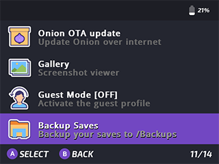
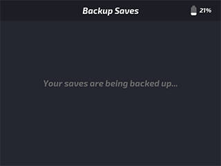

# Backup Saves for Miyoo OnionOS

Easily create snapshot style backups of your Miyoo Mini's `/Saves` folder with the click of a button 👾

## Installation

>_**Note:** Requires OnionOS (only tested on OnionOS 4.2+)_

1. To install, drag the `BackupSaves` folder into your `App` folder at the root of your SD card.
2. Order pizza! 🍕 🤘 😎

## Usage

1. Run `Backup Saves` from the apps section in the OnionOS main menu.

    

2. Wait for the backup process to complete. This should only take a few seconds.

    

3. That's it!

    - You should see a new `/Backups` folder at the root of your SD card.

        

    - As you can see, a snapshot of your `/Saves` folder is copied to `/Backups/{number}`, which auto-increments so that you never accidentally overwrite a backup.

    - Should anything happen, you can manually restore retroarch saves, states, etc. back to your `/Saves` folder as you see fit.
